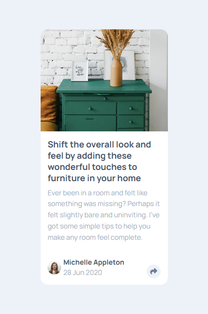
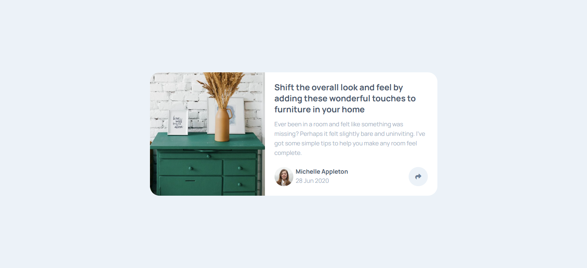

# Frontend Mentor - Article preview component solution

This is a solution to the [Article preview component challenge on Frontend Mentor](https://www.frontendmentor.io/challenges/article-preview-component-dYBN_pYFT). Frontend Mentor challenges help you improve your coding skills by building realistic projects. 

## Table of contents

- [Overview](#overview)
  - [The challenge](#the-challenge)
  - [Screenshot](#screenshot)
  - [Links](#links)
- [My process](#my-process)
  - [Built with](#built-with)
  - [What I learned](#what-i-learned)
  - [Continued development](#continued-development)
  - [Useful resources](#useful-resources)
- [Author](#author)

**Note: Delete this note and update the table of contents based on what sections you keep.**

## Overview

### The challenge

Users should be able to:

- View the optimal layout for the component depending on their device's screen size
- See the social media share links when they click the share icon

### Screenshot

### Links

- Solution URL: [The Github Solution](https://github.com/Banini-AD/article-preview-component)
- Live Site URL: [The live Site](https://article-preview-component-chi-ten.vercel.app/)

## My process

### Built with

- Semantic HTML5 markup
- CSS custom properties
- Flexbox
- CSS Grid
- Mobile-first workflow
- Sass

### What I learned

This project pushed me to the edge in learning fluid typography using the clamp property. Since fluid typography is essential for responsive website design, I spent weeks :weary: researching :computer: how to make fonts fluid amd responsive website design. It also helped me go in depth in building flexible layout. I learnt new and facinating things about the Sass preproserssor.

### Continued development

I want to continue to learn more on fluid typography. Getting to know more about how to let my browser do the heavy lifting in order to create fluid typography without any hustle. Thus making my life easier and making my website more robust and responsive. I also want to improve on my Sass journey (i.e learn more about it) in order to get the hang of it. I want to write good Sass codes in order to leverag its power to my advantage.

### Useful resources
- [Learn Sass By freeCodeCamp on Youtube](https://m.youtube.com/watch?v=_a5j7KoflTs&t=35s&pp=ygUKbGVhcm4gc2Fzcw%3D%3D) - This lengthy yet helpful YouTube tutorial provided the exposure I needed to get started with Sass. It offered detailed information on how to set it up, as well as insights on how and why to use it. The best part was that it demonstrated Sass in a real-world project, allowing us to see how it functions in actual applications.

## Author

- Github - [@Banini-AD](https://www.github.com/Banini-AD)
- Frontend Mentor - [@Banini-AD](https://www.frontendmentor.io/profile/Banini-AD)
- Discord - [@Banini-AD](https://discord.gg/dk9Aj3CU)